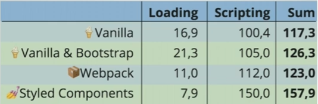
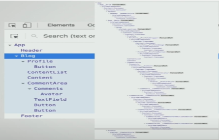

# CSS-in-CSS

## 정의

CSS는 CSS 파일에서 관리하겠다는 의미를 가지는 방식. CSS-in-JS가 나오기 이전까지 사용하던 전통적인 CSS 적용 방식이다. 특정 페이지에서 사용할 CSS 파일을 import하여 적용하는 형태를 띄고 있다. CSS 모듈을 사용하여 동일 프로젝트라도 클래스 이름 중복을 미연에 방지해준다.

## 장점

### 정돈된 코드

의외로 CSS는 CSS 파일에 넣어두는 것이 코드베이스적인 측면으로 봤을 때는 장점으로 다가온다. 결국 해당 파일에 있는 CSS가 하나의 페이지에 있는 컴포넌트들을 담당하고 있기 때문이다. 또한 CSS가 한 곳에서 관리되기 때문에, 그리고 보통 해당 페이지와 같은 폴더안에 묶여 있기 때문이다.

### 오히려 배우기 쉽다

CSS-in-JS가 컴포넌트 단위로 CSS 스타일링을 하는 기법으로 러닝커브가 낮다고는 하지만, 그럼에도 불구하고 JS 기반 지식이 있어야 사용할 수 있기 때문에, 기존 CSS를 사용하는 CSS-in-CSS가 오히려 러닝커브가 낮다고 할 수 있다.(실제로 styled-component 보다 SCSS를 사용하는 학생들이 많았음. 본인 경험)

### SEO 지원

SEO를 찾는 로봇들은 정돈된 HTML(CSS 파일과 HTML단이 분리되어 있기 때문에)을 더 잘 가져오기 때문에 Component depth가 깊은 CSS-in-JS와 달리 search engine에서 더 잘 포착된다.

### 로딩 하나만큼은 빠르다.

하기 CSS-in-JS의 단점인 초기 rendering 속도 저하가 없기 때문에 사용자에게 좀 더 좋은 경험을 줄 수 있다.

## 단점

### 타입스크립트 지원이 어렵다

안타깝게도 CSS Module 형태로 CSS 작성하기 위해서는 아래와 같은 index.d.ts파일이나 webpack 설정을 해줘야 한다.

```ts
declare module "*.module.css"; // TS module for CSS Module files
declare module "*.module.scss"; // TS module for CSS Module files in SCSS format
```

### 엄밀히 따지면 global 변수가 없다.

전역 CSS를 사용하기 위해 :global 이라는 프로퍼티를 사용해야 하지만, 엄밀히 따지면 이는 CSS 스펙에 포함되지 않으며 오히려 JS의 도움을 받아 구현된 스타일링 기법이라고 할 수 있다.

### 변화에 취약

CSS Module과 같은 CSS 스타일링 기법은 각기 다른 CSS 파일로 관리된다. 그렇기 때문에 변화하는 형태의 스타일을 적용하기가 극단적으로 어렵거나 불가능한 경우가 생긴다. 물론 아예 못하는건 아니다.

### 자꾸 덮어쓰여짐

해당 기술의 가장 큰 문제, 사실상 해당 문제로 인해 CSS in JS가 각광받게 되었다고 할 수 있다. CSS in JS에서도 상술하겠지만, 이로 인해 생기는 문제는 개발자로 하여금 !important를 남발하게 되어 디버깅이 매우 힘들게 되는 상황이 발생한다는 것이다.

# CSS-in-JS

## 정의

의미 그대로 CSS를 JS object 형태로 작성하는 것을 의미한다. 이러한 기법이 등장한 배경에는 Rendering과 깊은 관계를 가지고 있다.

기존의 CSS 파일의 동작방식은 HTML 다운로드 -> CSS 다운로드 -> First Paint와 같은 형태로 이뤄져 있는데, 이러한 방식은 CSS 다운로드가 끝난 이후 부터 사용자가 의미있는 페이지를 볼 수 있도록 설계되어 있다. 즉, rendering이 CSS 에셋 다운로드 이후에 이뤄진다는 것을 의미하며, 이는 곧 사용성의 하락으로 이어지게 된다.

이를 해결하기 위해 나온 방안은 의외로 CSS-in-JS가 아니다. 바로 HTTP2를 사용하는 방식이었다. 이러한 방식은 HTML과 CSS 에셋을 순차적으로 받는 이전 방식과 달리, HTML과 CSS를 여러개의 TCP 통신을 사용, 동시에 다운로드 받기 때문에 rendering 속도가 이전보다 빨라졌다.

또 하나의 접근 방식은 CSS 파일을 나누는 것이었다. 당연하게도 다운로드 받아야 하는 파일의 용량이 작을수록 다운로드 받는 시간이 빨라지니까.

그리고 나오는 방식이 바로 CSS-in-JS 방식이었다. 이미 기존의 HTML에 JS를 넣어서 하나의 Chunk 형태로 받아오는데 이를 CSS도 동일하게 할 수 있지 않겠냐 라는 접근에서 출발한 것이다. 이를 구현하기 위해 초기의 CSS-in-JS는 inline 스타일링으로 구현하였다. 이러한 아이디어를 먼저 적용한 Christopher Chedeau는 object 형태로 스타일을 만들고 이를 inline style에 spread 연산을 사용하여 append하도록 설계하였었다.

## 장점

### 디버깅 용이성

CSS Sheet를 따로 생성하여, 해당 class나 id를 통해 CSS를 적용하는 이전 방식과 달리 CSS-in-JS 의 법칙에 따르는 형태로 작성하게 되면 개발자가 어떤 부분이 어떤 “스타일된 컴포넌트”를 사용하였고, 어떻게 변화할지 예측할 수 있으며, 이전보다 비교적 간편하게 특정 CSS가 들어간 컴포넌트를 “자신감” 있게 수정 또는 개발할 수 있다.
appendonly stylesheet 라는 말이 있다. 이 말인 즉슨, 기존의 CSS style sheet가 너무 방대해져, 기존의 CSS style sheet를 수정할 수 없는 지경에 이르러 결국에는 계속 새로운 class나 id를 추가하는 형태로 개발이 이뤄지는 형태를 일컫는다. (ex. 텐소프트웍스의 서체가 그러했다. 지금은 몰루) 이에 반해, CSS-in-JS 시스템에서는 안 쓰이는 스타일 컴포넌트는 지우면 그만이기 때문에 이러한 일이 매우 드물다. (물론 일어날 수 있겠지만)

```ts
// styled-component 예시
const Title = styled.h1`
  color: red;
  font-size: 24px;
`;
/* 해당 코드는 styled-component로 한번 wrapping된 형태로 JSX component      형태로 return되는데, 이는 개발자가 해당 tag가 어떤 스타일을 가지고 있는지 한눈에 확인하기 용이하다. */
<Title>this is h1 tag with styled-component!</Title>;
```

### 팀워크의 향상

1에서 말한 모든 긍정적인 영향은 전체적인 코드베이스의 퀄리티를 높이고 나아가 개발 협업 측면에서 강력한 이점을 가져온다. 네이밍 컨벤션, class 또는 id가 중복되어 서로 충돌하는 상황 그리고 세부적인 스타일링이 필요한 상황에서의 불편함을 모두 극복할 수 있게 된다. 이는 곧 전체적인 개발 + 팀워크에 기여하게 된다.
성능 측면
혹자는 이 부분에서 반대할 수 있지만, 모든 CSS 스타일을 불러오는 기존의 형태와 달리, 해당 컴포넌트 혹은 렌더링에서 ‘쓰이는’ 최소한의 스타일만 불러오기 때문에 서버에서 가져오는 통신비용을 최소화 할 수 있다.

- 이와 같이 기존 CSS에 비해 대다수의 리액트앱에서 가장 널리 쓰이는 (4년 전 기준) CSS-in-JS 형태의 스타일링 방식은 2014년만 해도 미치광이의 개소리로 치부되곤 했다. (2014년 워싱턴 D.C에서 열린 Nation JS에서 당시 facebook에 근무하고 있던 Christopher Chedeau이 facebook이 CSS-in-JS를 가지고 어떻게 개발하는지에 대한 작은 연사를 한 적이 있는데, 이 엄청난 소식을 들은 당시 모든 개발 커뮤니티에서 미친 광대가 감히 신성한 CSS를 이따구로 개발하냐는 소리를 하며 엄청난 반발을 불러 일으켰었다.)

## 단점

### Lock in 효과

스타일 컴포넌트와 같은 대부분의 라이브러리들은 특정 JS 프레임워크 또는 라이브러리에 매우 의존적인 형태를 지니고 있다. 즉, 만약 특정 상황에서 해당 어플리케이션을 React -> Vue로 마이그레이션을 해야 한다면, 이 상황에서 벌어질 CSS 마이그레이션 비용을 생각하면 생각보다 만만치 않을 것이다.
진짜로 빠른가?
CSS-in-JS는 정말 기존 CSS보다 빠른가?. 이에 대한 분석을 한 영상이 있는데, 해당 영상에서는 두가지 기준을 잡고 성능 분석을 하였다. 하나는 Loading 나머지 하나는 Scripting이다.

- Loading에 영향을 주는 두가지 요소는 각각 파일 사이즈 그리고 사용자의 인터넷 커넥션이다.
- Scripting에 영향을 주는 세가지 요소가 있는데 각각 스크립트의 복잡성, 파일 사이즈, 그리고 사용자의 기기에 영향을 받는다(요즘 나오는 스마트폰은 성능이 우월하여 지금은 또 모르겠다.)

이에 대한 결과는 아래와 같다.



이러한 결과가 나오는 이유는 컴포넌트의 depth에 있다. 바닐라 CSS로 짜여진 어플리케이션의 VDOM을 살펴보면, HTML로 작성한 요소만 반영되는 반면, Styled-component로 짜여진 CSS-in-JS 형식의 경우, VDOM에 반영되는 요소가 기하급수적으로 늘어난 것을 확인할 수 있을 것이다.



이러한 차이는 styled-component가 생성되는 방식에서 나타난다. styled-component는 해당 스타일이 들어간 컴포넌트를 만들 때 HoC로 중첩된 형태로 만들어지기 때문.

# Next.js는 왜 tailwind CSS를 선호하는가?

- CSS-in-JS libraries which require runtime JavaScript are not currently supported in Server Components.

## Utility-First Approach

Tailwind CSS에서는 이 개념에 대해 이렇게 설명하고 있다.
ClassName을 생각할 필요 없이 개발 가능한 편의성
CSS 파일이 페이지에 비례하여 혹은 기하급수적으로 늘어나지 않음.
global CSS의 위험성을 줄여, 예기치 못한 오류를 발생시키지 않거나 그럴 가능성을 확실하게 줄임.
즉, 이러한 개발적 편의성에 초점을 둔 “특정 상황에 대비한 세트”같은 유틸리티 같은 이러한 개발방식은 커스텀 CSS를 사용하는것보다 React의 component-driven design 과 잘 맞아 떨어진다. 그렇기 때문에 React의 개발 원칙을 비슷하게 가져가고 있는 Next.js 또한 이와 잘 맞아 떨어진다.

## CSS-in-JS 의 태생적 한계

NextJs가 tailwind를 추천하는 이유는 기존의 CSS-in-JS의 태생적 한계가 명확하기 때문이다. CSS-in-JS의 또 다른 이름은 Runtime styleSheet인데, 이는 곧, 해당 CSS 파일이 JS의 런타임 때 실행된다는 것을 의미한다. 즉, 웹 브라우저에서 구동된다는 것을 의미한다. 이러한 이슈가 있기 때문에 NextJs의 hydrate 때 css가 적용되지 않은 naked HTML이 잠깐 보이게 되는 치명적인 이슈가 있다.
물론, critical CSS 적용 방식을 통해 이를 해결할 수 있지만, 같은 CSS를 불러와야 한다는 문제점이 있다.
