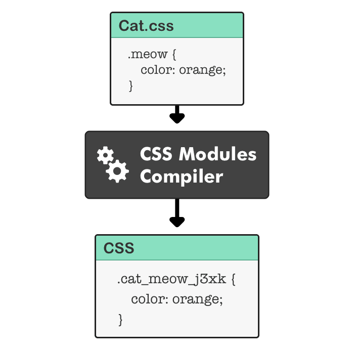

# CSS in JS란?

JS 코드 내에서 CSS를 작성하여 적용하는 방식이다.

전통적인 웹 개발 방식과 다르게 스타일링을 모듈화하여 동적으로 처리할 수 있다.

- 스타일을 각 컴포넌트와 함께 정의하여 모듈화가 가능하다.
- 컴포넌트 내에서 스타일을 정의하여 충돌을 방지하고 유지보수가 용이하다.
- JS의 조건문, 변수 등을 사용해 상태에 따른 동적 스타일링이 가능하다.
- 각 스타일이 컴포넌트에 한정되도록 하여, 전역 충돌을 방지 할 수 있다.

## 📍 CSS in JS 종류

### → styled-components

JS를 사용하여 스타일링을 위한 프레임워크이며, 컴포넌트 기반 프레임워크에 최적화되어 있다.

- 템플릿 리터럴로 작성하여 스타일을 작성한다.
- 모듈화가 가능하다.
- props나 theme 속성을 사용하여 컴포넌트 외부에서 스타일 관리가 가능하다.

### → Emotion

# CSS in CSS란?

CSS 파일 내부에 CSS 스타일을 작성하는 방식을 말한다.

전통적인 방식으로 CSS 파일을 별도로 분리하여 HTML 파일에 import하여 스타일을 적용한다.

## 📍 CSS in CSS 종류

### → CSS Module

CSS 파일을 모듈화하여 각 모듈의 스타일 클래스 이름이 중첩되는 것을 방지한다.

컴포넌트 기반 라이브러리에서 사용된다.

- `.module.css` 파일을 생성하여 스타일을 정의한다.
- JS파일에서 import하여 클래스명을 사용한다.
- 각각의 고유값을 가지므로 충돌을 막을 수 있다.
- 컴포넌트 단위의 스타일을 적용할 때 유용하다.

### → CSS 전처리기

`Scss` | `Less` | `Stylus`

전처리기가 가진 특별한 구문으로 CSS를 생성하는 프로그램이다.

- 반복적이거나 공통으로 쓰이는 것을 변수 또는 함수로 대체하여 재사용이 가능하다.
- 중첩, 상속을 사용하여 구조화된 코드로 유지보수가 용이하다.
- 전처리기를 위한 도구가 필요하며 컴파일하는데 시간이 소요된다.

### → Tailwind CSS

Utility-First\*를 지향하는 CSS 프레임워크로, 미리 정의된 클래스를 사용하여 HTML에 스타일을 적용한다.

(\*미리 세팅된 유틸리티 클래스를 활용하여 HTML에 스타일링 )

- 각 속성을 클래스에 작성하여 코드에서 직관적으로 확인할 수 있습니다.
- 속성이 늘어나면서 코드의 가독성이 떨어질 수 있다.
- 다른 프레임워크에 비해 커스텀이 자유롭다.
- JS 코드를 사용하여 스타일링이 어렵다.(클래스명 분기처리는 가능)

# CSS in JS vs CSS in CSS

## 📍 CSS in JS

`장점`

- 컴포넌트 기반의 구조이며, 각 컴포넌트의 스타일을 독립적으로 관리 가능하다.
- 상태에 따른 스타일을 변경할 수 있는 동적 스타일링이 가능하다.
- 코드 재사용 및 모듈화하여 유지보수가 용이하다.
- 벤더 프리픽스를 자동화하여 브라우저 호환성 유지가 가능하다.

`단점`

- 브라우저에서 CSS 파일을 캐시 할 수 없어 초기 렌더링 속도에 영향을 줄 수 있다.
- CSS in CSS에 비해 러닝커브가 있다.

## 📍 CSS in CSS

`장점`

- HTML, CSS를 분리하여 각 파일의 역할이 명확하며 유지보수가 용이하다.
- 전역 스타일 관리가 가능하다.
- 브라우저 캐싱이 가능하여 성능 향상이 가능하다.

`단점`

- 클래스명이 중복되어 충돌할 가능성이 있다.
- 동적 스타일링이 어렵다.
- 코드의 재사용 및 모듈화가 어렵다.

## 📍 비교

|                    | CSS in JS                                                             | CSS in CSS                                                             |
| ------------------ | --------------------------------------------------------------------- | ---------------------------------------------------------------------- |
| 모듈화 및 재사용성 | 스타일을 컴포넌트와 함께 정의하여 모듈화와 재사용성이 높다.           | 스타일이 전역에서 관리되어서 모듈화와 재사용성이 낮다.                 |
| 동적 스타일링      | JS의 조건문, 변수 등을 사용하여 상태에 따라 동적 스타일링이 유연하다. | JS DOM요소에 클래스를 추가,제거하여 동적 스타일링이 가능하나 복잡하다. |
| 성능               | 동적 스타일링으로 인한 렌더링 속도 저하                               | 정적 파일을 사용하여 렌더링 속도가 우수하다.                           |
| 러닝 커브          | 초기 설정이 필요하며 러닝 커브가 있다.                                | 전통적인 방식으로 러닝 커브가 적다.                                    |

# NextJS는 왜 CSS in CSS(tailwind) 를 선호하는가

Next.js에서는 CSS 모듈과 Tailwind css가 기본으로 내장 지원한다.

### 그 이유는 뭘까?🤔

CSS in JS는 JS를 사용하여 스타일을 정의한다. 그렇기 때문에 런타임에 동적으로 스타일이 적용되는데 이는 빌드 시에 CSS 파일이 준비되어야 하는 Next.js의 서버 컴포넌트들과 호환성이 떨어진다. 반대로 CSS in CSS는 빌드 시에 CSS 파일로 변환되기 때문에 서버 컴포넌트와의 호환성이 높다.
