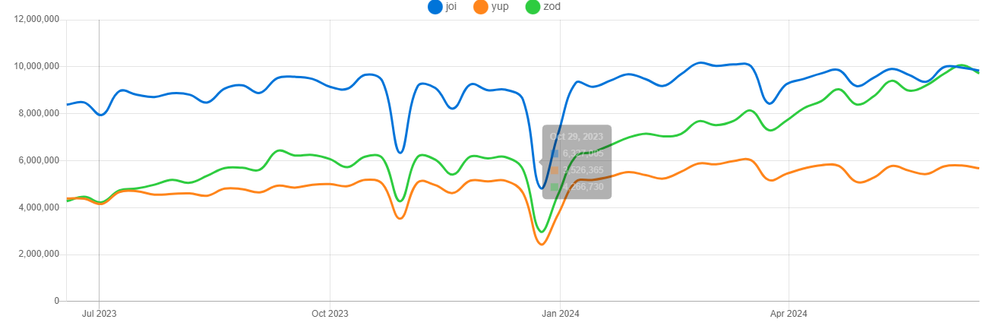
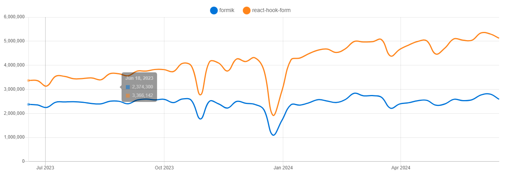

# What is Zod, Yup and Joi?

# 0. 작성 배경

React나 Next.js를 이용하면 항상 **React-hook-form**을 빼먹지 않고 사용한다.

hook-form을 사용할 때 가장 아쉬웠던 부분이 있는데 데이터 검증을 처리해주는 로직이 늘어남에 따라 코드가 지저분해지는 부분이다.

그래서 해당 문제를 해결하기 위해 어떤 방법이 있나 찾아본 결과 최초에는 Yup이라는 라이브러리를 찾아서 사용했고 굉장히 만족했었다. 하지만 개인적으로 Zod가 조금 더 타입스크립트 친화적이고 사용이 간편해서 Zod를 사용했다.

이번 기회에 각 라이브러리들의 특징과 **왜? 사용하는지**를 확실히 학습해보는 시간을 가져보도록 하겠다.

# 1. 스키마

해당 라이브러리는 통상적으로 **스키마** 정의 라이브러리라고 불린다. 그렇다면 여기서 **스키마**란 정확히 무엇일까?

## what is schema?

스키마란 데이터의 구조와 제약 조건을 정의하는 명세서나 청사진이라 할 수 있다. 이를 통해 데이터가 어떻게 구성되고 어떤 형식을 가져야 하는지를 명확히 규정할 수 있다. 스키마는 비단 자바스크립트 뿐만아니라 데이터베이스, XML, JSON, 프로그래밍 언어 등 다양한 컨텍스트에서 사용된다.

## **Why are you using the schema?**

스키마를 사용하는 이유는 크게 4가지로 볼 수 있다.

1. 데이터 구조 정의
2. 유효성 검사
3. 문서화
4. 데이터 변환 및 직렬화

## **Where do you use the schema?**

백문이 불여일견이라고 코드를 살펴보도록 하자

- 데이터베이스
  ```sql
  CREATE TABLE Users (
      id INT PRIMARY KEY,
      name VARCHAR(100),
      email VARCHAR(100) UNIQUE,
      age INT CHECK (age > 0)
  );
  ```
- JSON
  ```json
  {
    "$schema": "http://json-schema.org/draft-07/schema#",
    "title": "User",
    "type": "object",
    "properties": {
      "name": {
        "type": "string"
      },
      "email": {
        "type": "string",
        "format": "email"
      },
      "age": {
        "type": "integer",
        "minimum": 0
      }
    },
    "required": ["name", "email", "age"]
  }
  ```
- Python (pydantic)
  ```python
  from pydantic import BaseModel, EmailStr, PositiveInt

  class User(BaseModel):
      name: str
      email: EmailStr
      age: PositiveInt

  # 유효한 데이터
  user = User(name='John Doe', email='john.doe@example.com', age=25)
  print(user)

  # 유효하지 않은 데이터 (예외 발생)
  try:
      invalid_user = User(name='Jane Doe', email='invalid-email', age=-1)
  except ValueError as e:
      print(e)
  ```
- Java
  ```java
  import javax.validation.constraints.Email;
  import javax.validation.constraints.NotBlank;
  import javax.validation.constraints.Positive;

  public class User {
      @NotBlank(message = "Name is mandatory")
      private String name;

      @Email(message = "Email should be valid")
      private String email;

      @Positive(message = "Age should be positive")
      private int age;

      // Getters and setters
  }

  // 사용 예시
  import javax.validation.Validation;
  import javax.validation.Validator;
  import javax.validation.ValidatorFactory;
  import javax.validation.ConstraintViolation;
  import java.util.Set;

  public class Main {
      public static void main(String[] args) {
          ValidatorFactory factory = Validation.buildDefaultValidatorFactory();
          Validator validator = factory.getValidator();

          User user = new User();
          user.setName("John Doe");
          user.setEmail("john.doe@example.com");
          user.setAge(25);

          Set<ConstraintViolation<User>> violations = validator.validate(user);

          if (violations.isEmpty()) {
              System.out.println("User is valid");
          } else {
              for (ConstraintViolation<User> violation : violations) {
                  System.out.println(violation.getMessage());
              }
          }
      }
  }
  ```
- Flutter (Dart - json_serializable)
  ```dart
  import 'package:json_annotation/json_annotation.dart';

  part 'user.g.dart';

  @JsonSerializable()
  class User {
    @JsonKey(required: true)
    final String name;

    @JsonKey(required: true)
    final String email;

    @JsonKey(required: true)
    final int age;

    User({required this.name, required this.email, required this.age});

    factory User.fromJson(Map<String, dynamic> json) => _$UserFromJson(json);
    Map<String, dynamic> toJson() => _$UserToJson(this);
  }

  // 사용 예시
  import 'dart:convert';

  void main() {
    final jsonString = '{"name": "John Doe", "email": "john.doe@example.com", "age": 25}';
    final user = User.fromJson(json.decode(jsonString));

    print('Name: ${user.name}, Email: ${user.email}, Age: ${user.age}');
  }
  ```

# 2. 스키마 정의 라이브러리 (Zod, Yup, and Joi)

자 이제 스키마가 무엇인지 알았고 어떻게 사용되는지 알았으니 이제 Zod와 Yup과 Joi가 무엇인지 알아보도록하자

## 1. Zod

### 정의

> **Zod는 TypeScript 우선 스키마 선언 및 유효성 검사 라이브러리이다. Zod는 스키마를 사용하여 단순한 `string` 부터 복잡한 중첩 객체까지 모든 데이터 유효성을 검사한다.**
>
> **Zod는 가능한 한 개발자 친화적으로 설계했다. 그 목표는 중복된 유형 선언을 제거하는 것이다. Zod를 사용하면 유효성 검사기를 한 번만 선언 하면 Zod는 자동으로 정적 TypeScript 유형을 추론한다.**

정의는 공식 홈페이지에서 가져왔다.

### 사용법

사용법은 작성하려 했으나 사실상 공식 홈페이지에 있는 예제를 복사하는 작업의 반복이기 때문에 생략하도록 하겠다.

## 2. Yup

> **Yup은 런타임 값 파싱 및 유효성 검사를 위한 스키마 빌더이다. 스키마를 정의하고, 값을 변환하여 일치시키거나, 기존 값의 모양을 주장하거나, 둘 다를 수행한다. Yup 스키마는 표현력이 매우 뛰어나서 모델링이 복잡하거나, 상호의존적인 유효성 검사 또는 값 변환을 수행할 수 있다.**

yup 역시 정의는 공식 홈페이지에서 가져왔다.

## 3. Joi

> **자바스크립트를 위한 가장 강력한 스키마 설명 언어 및 데이터 검증기입니다.**

joi도 마찬가지로 공식 홈페이지 정의를 가져왔다.

## 4. what is different?

사실 이렇게 보면 큰 차이는 없어 보인다. 실제로도 서로의 사용법은 굉장히 비슷하지만 지금부터 각각의 차이점을 확인해보도록 하자

### **joi is a little different from zod and yup.**

Joi같은 경우는 프론트엔드 진영보다는 Node 진영에서 많이 사용하는 라이브러리다. 애초에 공식 홈페이지에서도 CJS를 이용하는 예제를 많이 작성하고 실제로 레퍼런스를 찾아봐도 React나 Next같은 프론트 진영에서 사용되는 라이브러리보다는 Node에서 많이 사용하는 모습을 확인 할 수 있다. 그러므로 이번 문서에서는 zod와 yup의 차이점에 대해서 더 집중해보도록 하겠다.

### zod vs yup



우선 npm trend를 살펴보면 서로 비슷한 양상을 보이다 zod가 yup을 크게 따돌리고 심지어 joi마저 추월하는 경향을 볼 수 있다. 그 이유를 자세히 작성해준 포스팅이 있어 참조하여 작성해 보도록 하겠다.

1. **TypeScript support**

   zod나 yup 모두 타입스크립트를 지원하지만 yup보다 zod가 조금 더 높은수준으로 지원해준다. 아래의 코드는 각 zod와 yup으로 생성한 스키마를 이용해 type을 이용해서 생성한 변수가 올바른 데이터인지 확인하는 예제코드인데 yup의 `InferType` 과 zod의 `infer` 메서드는 서로 비슷한 역할을 하지만 yup으로 생성한 `type A` 는 타입에러를 발생시키지 않지만 zod를 이용해서 생성한 `type B` 는 타입에러를 발생시킨다.

```dart
import * as yup from "yup";
import * as zod from "zod";

const yupSchema = yup.string()
type A = yup.InferType<typeof yupSchema>
const x: A = 12 // wrong, but nothing happens

const zodSchema = zod.string();
type B = zod.infer<typeof zodSchema>; // string
const y: B = 12; // TypeError
```

1. **Ecosystem**

   zod는 기본적으로 typescript를 기본 고려사항으로 설계됐다. 하지만 yup은 단순히 typescript를 지원하도록 설계되어 zod과 yup보다 typescript와 호환성이 더 좋다.

   현재 대규모의 프로젝트에서 타입스크립트를 사용하기 때문에 이러한 이유로 zod와 yup의 격차가 더 벌어졌다고 생각한다.

2. **Integrations**

   yup은 formik과 통합이 더 쉬운 라이브러리이지만 zod는 오히려 react-hook-form과 통합이 더 쉽다. 항상 react-hook-form을 우선 나로서는 yup보다는 zod를 사용하는 것이 더 좋을 텐데 formik과 react-hook-form의 npm trend를 살펴봐도 hook-form의 사용량이 더 많기 때문에 여기서도 zod와 yup의 격차가 벌어졌다고 생각한다.

   

   # 결론

   zod나 yup이나 joi나 사실 사용법을 뜯어보면 크게 다르지 않다. 조금의 차이점은 있을 수 있지만 기본적인 사용법은 거의 비슷하기 때문에 사실 무엇을 사용해도 크게 다르지 않을 것이다. 하지만 프론트엔드 개발을 하고 있는 유저라면 hook-form과 zod의 조합이 좋기 때문에 특별한 이유가 없는 한 joi나 yup을 사용할 필요는 없어 보인다.

   마지막으로 해외 개발자들은 해당 이슈에 대해 어떻게 생각하는지 궁금해서 찾아봤는데 가볍게 살펴보도록 하자.

   
