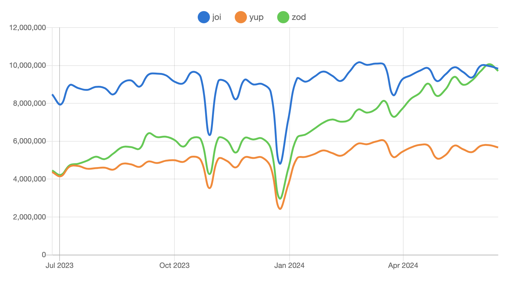

# 1. JavaScript(TypeScript) Data Validation

사용자가 입력한 데이터 값이 서버로 전송되기 전, 특정 규칙이나 형식에 맞게 입력이 되었는지 검증하는 것을 말한다.  
<br>

## 📍 데이터 유효성 검증이 필요한 이유는?

1. **사용자 경험 개선**

   사용자가 입력 오류를 실시간으로 확인하여 알려주어 나은 경험을 제공할 수 있다.

2. **보안 강화**

   검증 절차를 걸치면서 취약점을 예방하며 잘못된 데이터의 차단이 가능하다.

3. **코드 유지보수성 향상**

   입력된 데이터가 항상 유효하다라고 가정할 수 있게 되면서 코드가 간결해지며 오류 발생을 줄입니다.

4. **데이터 무결성 유지**

   잘못된 데이터를 미리 걸러냄으로써 동작 오류를 방지 할 수 있다.

<br>

# 2. 유효성 검사 라이브러리

애플리케이션의 규모가 커지면서 복잡한 데이터들을 관리하고 검증하는 것이 중요해졌다. 지속적인 유지보수와 확장성을 고려했을 때, 데이터의 유효성 검사 규칙을 관리하고 구조를 가진 스키마 기반의 유효성 검사가 새롭게 떠오르게 되었다.

<br>

## 📍 스키마(Schema)란?

정의하자면 ‘데이터의 구조’ 또는 ‘데이터베이스의 설계’를 의미한다. 일종의 규칙이나 지침을 정의하며 스키마를 사용해서 데이터의 구조를 명확히하고, 데이터가 특정 규칙을 따르도록 하는데 사용된다.

<br>

## 📍 동작하는 원리는?

1. **스키마 정의**

   데이터 구조, 타입, 유효성 검사 규칙을 정의한다.

2. **데이터 검증**

   스키마에 정의된 규칙을 기준으로 입력된 데이터를 검증한다.

3. **오류 처리**

   유효성 검사 과정에서 발생한 오류들을 메시지와 함께 제공한다.

<br>

## 📍 스키마 기반 라이브러리

### 1. Zod

TypeScript 우선 스키마 선언 및 유효성 검사 라이브러리이다. 스키마를 기준으로 타입 추론이 가능하며 Zod의`infer`와 JavaScript의 `typeof`를 활용하면 타입을 따로 작성할 필요가 없다는 장점이 있다.

- **타입 안정성**
  컴파일 시 데이터 유효성 검증 관련 오류를 쉽게 찾을 수 있으며, 런타임에서 발생하는 유효성 검증 관련 오류를 방지할 수 있다.
- **간결한 구문**
  스키마를 정의하는데 간결한 구문을 제공하여 복잡한 유효성 검사 규칙도 쉽게 정의 가능하다.
- **비동기 유효성 검사**
  유효성 검사 과정에서 비동기 작업 수행을 지원한다.
- **확장성**
  다른 양식의 유효성 검사 라이브러리와 통합이 용이하며, 사용자가 직접 로직을 설정할 수 있도록 한다.
- **유연한 검증 로직**
  다양한 검증 함수와 조합을 제공한다. 이는 복잡한 유효성 검사 규칙을 만들 수 있으며 데이터의 정확성과 안정성을 높일 수 있다.

```jsx
import { z } from 'zod';

const UserSchema = z.object({
  name: z.string(),
  age: z.number().int().nonnegative(),
  email: z.string().email(),
});

**type User = z.infer<typeof UserSchema>; // TypeScript 타입 추론**

const userData = {
  name: 'John Doe',
  age: 30,
  email: 'john@example.com',
};

try {
  UserSchema.parse(userData);
  console.log('User data is valid');
} catch (e) {
  console.error('Validation failed:', e.errors);
}
```

→ 공식 문서 [TypeScript-first schema validation with static type inference](https://zod.dev/?id=basic-usage)

<br>

### 2. Yup

JavaScript와 TypeScript 환경에서 스키마 선언 및 데이터 유효성 검사를 위한 라이브러리이다. 직관적인 메소드 체인(`.string()`, `.email()`, `.required()`)을 통해 검증 규칙을 정의하여 유효성 검사의 목적을 명확하게 표현하여 가독성과 유지보수성을 높이는 장점이 있다.

```jsx
import * as yup from "yup";

const UserSchema = yup.object().shape({
  name: yup.string().required("Name is required"),
  age: yup
    .number()
    .integer("Age must be an integer")
    .min(0, "Age must be a positive number"),
  email: yup
    .string()
    .email("Invalid email format")
    .required("Email is required"),
});

const userData = {
  name: "John Doe",
  age: 30,
  email: "john@example.com",
};

UserSchema.validate(userData)
  .then(() => {
    console.log("User data is valid");
  })
  .catch((err) => {
    console.error("Validation failed:", err.errors);
  });
```

→ 공식 문서 [https://github.com/jquense/yup](https://github.com/jquense/yup)

<br>

### 3. Joi

Node.js에서 사용할 수 있는 데이터 검증 및 스키마 유효성 검사 라이브러리이다.

```jsx
const Joi = require("joi");

const UserSchema = Joi.object({
  name: Joi.string().required(),
  age: Joi.number().integer().min(0).required(),
  email: Joi.string().email().required(),
});

const userData = {
  name: "John Doe",
  age: 30,
  email: "john@example.com",
};

const { error } = UserSchema.validate(userData);
if (error) {
  console.error("Validation failed:", error.details);
} else {
  console.log("User data is valid");
}
```

→ 공식 문서 [joi.dev](https://joi.dev/api/?v=17.13.3)

<br>

## 📍 어떤걸 사용하면 좋을까?

npm trends를 보면 Zod와 Joi의 비율이 높은 걸 알 수 있었다. 하지만 애플리케이션의 요구 사항에 따라 유리한 라이브러리를 사용하면 될 것 같다.



- Zod와 Yup은 둘다 TypeScript를 지원하며, Zod가 TypeScript와의 통합이 잘 되어 있어 타입 안정성이 중요할 때 유리할 수 있다.
- TypeScript를 사용하며 API 데이터 교환이 많고 클라이언트와 서버 간에 전달되는 모든 데이터의 유효성을 검사해야 하는 경우는 Zod를 선택하는 것이 좋다.
- 애플리케이션에서 복잡한 유효성 패턴이 필요한 경우 직관적인 메소드 체인을 통해 스키마를 정의하는 Yup을 사용하는 것이 좋다.

<br>

## 📍 참고 자료

[Comparing schema validation libraries: Zod vs. Yup - LogRocket Blog](https://blog.logrocket.com/comparing-schema-validation-libraries-zod-vs-yup/#schema-validation-yup)
