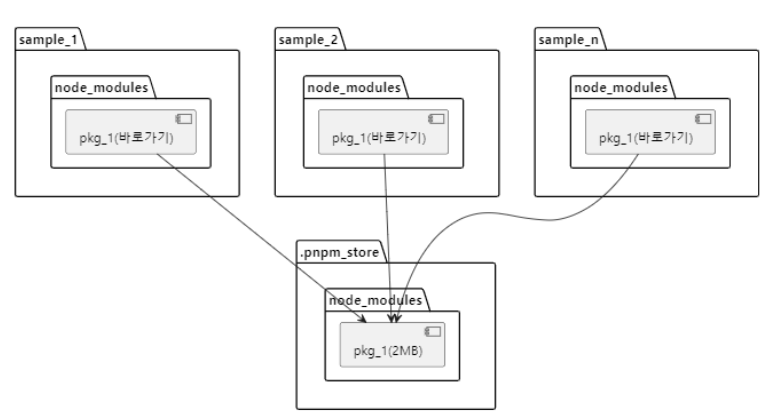

# Package Manager
자바스크립트와 타입스크립트 및 외부 패키지를 사용하면서 패키지 매니저를 당연하게 사용해왔다.   
사용은 해왔지만 막상 정확한 역할에 대해 몰랐던 것 같다. 그리하여 당연하게 사용해왔던 패키지 매니저에 대해 알아보려고 한다.

 

# 1. 패키지 매니저란?

프로젝트에 필요한 외부 라이브러리 및 모듈, 플러그인 등을 쉽게 설치하고 관리하는 역할을 한다.   
자바스크립트 프로젝트에서 필수적인 도구로 의존성 관리와 프로젝트 구축을 간편하고 효율적으로 만들 수 있다.

- 패키지 설치
    - 필요한 패키지를 설치하고, 패키지 매니저를 통해 패키지의 이름이나 버전을 지정하여 설치할 수 있다.
- 의존성 관리
    - 패키지는 다른 패키지에 의존할 수 있으며, 이러한 의존성을 자동으로 해결하여 패키지를 설치한다.
- 버전 관리
    - 패키지의 다양한 버전을 관리한다. 특정 버전의 패키지를 설치 하거나 업데이트를 한다.
- 스크립트 실행
    - 프로젝트에 미리 정의된 스크립트를 실행하는 기능을 제공한다. 이를 통해 빌드, 배포 등의 자동화 작업이 가능하다.

 

# 2. 패키지 매니저 동작 방식

### 1. Resolution

이 단계에서 package.json에 명시된 버전 범위에 따라 정확한 버전을 고정한다.   
그 다음, 설차한 라이브러리가 사용하는 다른 라이브러리에 대한 의존성을 확인하여, 그 의존성의 버전도 고정하고 package-lock.json에 저장한다.

### 2. Fetch

Resolution 단계에서 결정된 버전을 실제로 다운로드하는 과정이다. 

### 3. Link

Resolution, Fetch 된 라이브러리를 소스 코드에서 사용할 수 있는 환경 제공한다.

 

# 3. 패키지 매니저의 종류

대표적인 자바스크립트 패키지 매니저로는 **yarn, npm, pnpm** 등이 있다.

 

## 📍 npm

- Node.js와 함께 기본적으로 설치되며, 가장 대표적 패키지 매니저이다.
- CLI를 제공하여 패키지 설치, 버전 관리 및 의존성 해결 등의 기능을 한다.
- 버전 잠금 파일(package-lock.json)을 제공한다.

| 장점 | 단점 |
| --- | --- |
| 가장 널리 쓰이며 다양한 라이브러리와 도구를 쉽게 검색하고 설치할 수 있다. | 개별 설치되어 의존성이 중복으로 설치될 수 있다.|
| package.json 파일을 통해 프로젝트의 전체적인 의존성을 관리할 수 있으며, 잠금 파일을 통해 일관된 환경 유지가 가능하다. | 의존성이 깊어질수록 설치 속도가 느려지며, 디스크 공간 차지 부담이 커진다. |
| package.json 파일에 정의된 스크립트를 통해 빌드, 배포 작업을 자동화 할 수 있다. | 의존성 버전이 명확히 지정되지 않으면, 작업자들 간에 호환성 문제가 있을 수 있다. |

 

## 📍 yarn

- npm의 일관성, 보안, 빌드 시 성능 등의 문제를 해결하기 위해 facebook에서 개발했다.
- 버전 잠금 파일(yarn.lock)을 제공한다.

| 장점 | 단점 |
| --- | --- |
| 여러 패키지를 동시에 가져와 설치 하도록 하여 npm 보다 빠른 의존성 설치 속도와 패키지 버전관리를 제공한다. | npm의 문제를 해결하여 나온 패키지 매니저이지만, 여전히 유령 의존성을 최소화하는데 어려움이 있다. |
| yarn.lock 파일을 사용하여 동일한 패키지 버전을 보장하여 팀원 간의 개발 환경을 일관되게 유지할 수 있다. |  |
| 다운로드한 패키지를 로컬 캐시에 저장하여 동일 패키지를 다시 설치할 때 네트워크 요청없이 빠르게 설치 가능하다. |  |
| yarn.lock 또는 package.json 파일에 있는 패키지만 설치하여 보안이 강화되었다. |  |

 > **유령 의존성이란?**    
 > npm이나 yarn에서 중족해서 설치되는 node_modules를 아끼기 위해 호이스팅한다.호이스팅되면서 직접 의존하고 있지 않은 라이브러리를 require() 할 수 있는 현상을 유령의존성이라 한다. 이 현상이 발생 되면, package.json 파일에 명시하지 않은 라이브러리를 사용할 수 있게 되는데 다른 의존성을 제거했을 때 같이 사라진다. 이런 특성은 의존성 관리 시스템에 혼란을 준다.

 

## 📍 yarn berry

- 무거운 node_modules와 유령 의존성 문제를 해결을 위한 yarn의 새로운 버전이다.
- PnP(plug’n play)이라는 새로운 패키지 관리 시스템을 제공하여, 기존 무거웠던 node_modules 폴더 대신 .zip 파일로 압축, cache 폴더에 .pnp.cjs 파일로 기록하여 관리한다. 이 파일로 패키지의 위치를 정확히 알 수 있기 때문에 중복 설치를 방지하여 유령 의존성 문제도 해결할 수 있다.
- zero-install는 PnP로 인해 무거웠던 node_modules 폴더를 제거하여 패키지 관리와 패치된 결과물을 git에 포함시켜 설치 과정을 생략할 수 있다.

| 장점 | 단점 |
| --- | --- |
| 여러 패키지를 동시에 가져와 설치 하도록 하여 npm 보다 빠른 의존성 설치 속도와 패키지 버전관리를 제공한다. | PnP 방식을 사용하지 않는 패키지와 호환성 문제를 일으킬 수 있다. |
| yarn.lock파일을 사용하여 의존성 트리를 고정시켜 재현 가능한 빌드를 지원한다. |  |
| 캐시 기능으로 패키지 다운로드를 최적화한다. |  |

Zero-install 이라는 방법을 사용하는데, 이는 모든 패키지가 압축된 파일 형태로 존재하기 떄문에 따로 의존성을 설치하는 과정을 거치지 않고 그대로 사용할 수 있다. 그렇기 때문에 배포 시간도 단축시킬수 있다.

 

## 📍 pnpm

- npm과 yarn에 비해 새로운 패키지 매니저로, 패키지 의존성 중복 문제를 해결한 패키지 매니저이다.
- 별도의 저장소(pnpm_store)안에 프로젝트별로 바로가기(심볼릭링크)를 만들어, 중복된 저장공간을 효율화 할 수 있다.

| 장점 | 단점 |
| --- | --- |
| 프로젝트별로 하드 링크를 생성하여 패키지를 공유하며, 중복된 파일을 최소화하여 효율적으로 디스크 공간 사용이 가능하다. | 일부 패키지나 도구가 pnpm과 호환되지 않을 수도 있다. |
| 패키지 다운로드 및 설치를 병렬적으로 처리하여 빠르게 설치할 수 있다. | 문제 해결을 위한 커뮤니티 지원이 적을 수 있다. |
| npm과 대부분 호환되며 스크립트와 명령어를 그대로 사용 가능하다. |  |

🤔 하드링크와 심볼릭링크의 개념이 헷갈린다,,,,

 

### 참고자료

[패키지 매니저의 과거, 토스의 선택, 그리고 미래](https://toss.tech/article/lightning-talks-package-manager)

[node_modules로부터 우리를 구원해 줄 Yarn Berry](https://toss.tech/article/node-modules-and-yarn-berry)