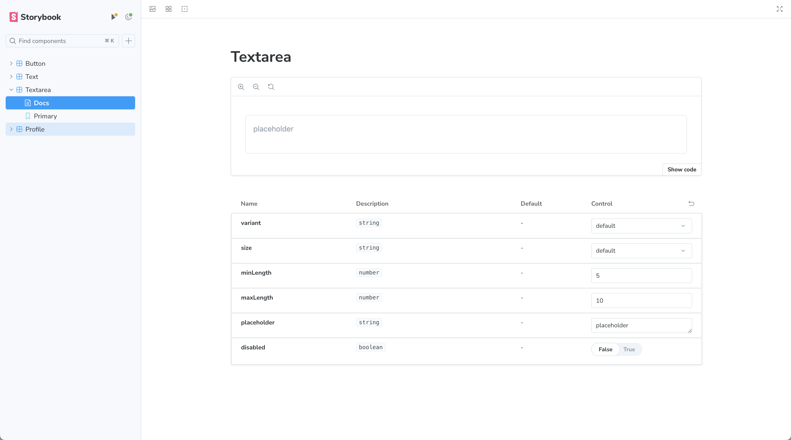

# Storybook

이전에 cva / twMerge / clsx를 사용하여 리팩토링한 공통 컴포넌트들을 storybook을 사용하여 문서화 작업을 하려고 한다.

리팩토링한 textarea 컴포넌트를 storybook에 연동하였다.

</br>

## 📍 Storybook이란?

작업한 컴포넌트들을 테스트 하고 문서화하도록 도와주는 UI 컴포넌트 개발 도구이다.

UI 컴포넌트 라이브러리의 문서화를 위해 사용할 수도 있고 디자인 시스템을 개발하기 위한 플랫폼으로도 사용할 수도 있다.

</br>

### 1. 설치

```bash
npx storybook@latest init
```

설치하면 storybook 폴더와 stories 폴더가 생성되고,

storybook 폴더안에 main.ts 파일(전체 스토리북 설정)에서 "@storybook/addon-onboarding"을 삭제하고

preview.ts 파일(미리보기 화면 설정)에서 global.css 파일을 import한다.

</br>

```bash
"scripts": {
		...
    "storybook": "storybook dev -p 6006",
    "build-storybook": "storybook build"
  },
```

또한 package.json에 두가지 개발 의존성이 추가 된다.

(스토리북을 로컬 서버에 실행시키거나 스토리북을 원격 서버에 배포하기 위해 빌드해주는 역할을 한다.)

</br>

### 2. 실행

```bash
npm run storybook
```

위 명령어로 실행하면 6006포트로 설치한 storybook을 확인할 수 있다.

</br>

### 3. stories 파일 생성

textarea 컴포넌트의 stories 파일을 생성한다.

```tsx
import { Meta, StoryObj } from "@storybook/react";
import { Textarea } from "@/component/common/textarea/index";

**//메타 데이터, 제네릭에 컴포넌트의 타입을 넘겨준다.**
const meta: Meta<typeof Textarea> = {
	**// 스토리북 Name**
  title: "Textarea",
  **// 컴포넌트**
  component: Textarea,
  **// 컴포넌트에 대한 문서 자동 생성**
  tags: ["autodocs"],
  **// 각 args의 동작을 지정한다.**
  argTypes: {
    variant: {
	    **// control의 타입을 정의**
      control: {
        type: "select",
      },
      **// control에 들어가는 옵션 정의**
      options: ["default", "gray"],
    },
    size: {
      control: {
        type: "select"
      },
      options: ["default", "fit", "sm", "md", "lg"],
    },
    placeholder: {
      control: {
        type: "text"
      }
    },
    minLength: {
      control: {
        type: "number"
      }
    },
    maxLength: {
      control: {
        type: "number"
      }
    },
    disabled: {
      control: {
        type: "boolean"
      },
    },
  },
};

export default meta;

**// 스토리 타입, StoryObj의 제네릭에 컴포넌트의 타입을 넘겨준다.**
type Story = StoryObj<typeof Textarea>;

export const Primary: Story = {
**// key, value가 textarea props로 들어간다.**
  args: {
    variant: "default",
    size: "default",
    minLength: 5,
    maxLength: 10,
    placeholder: "placeholder",
    disabled: false,
  }
};
```


